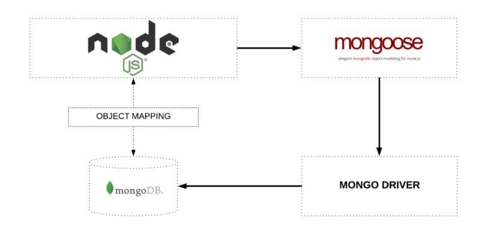
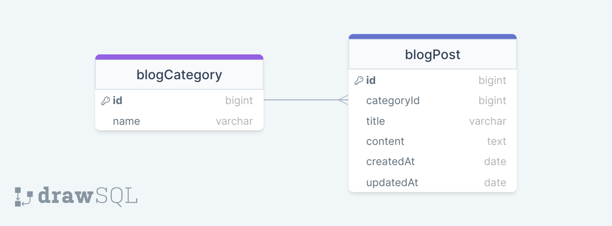

# BLOG Project with Mongoose

## MONGOOSE

https://mongoosejs.com/

### What? Why?



## BLOG API

### ERD:



### Folder/File Structure:

```
    .env
    .gitignore
    index.js
    readme.md
    src/
        errorHandler.js
        dbConnection.js
        models/
            blog.js
        controllers/
            blog.js
        routes/
            blog.js
```